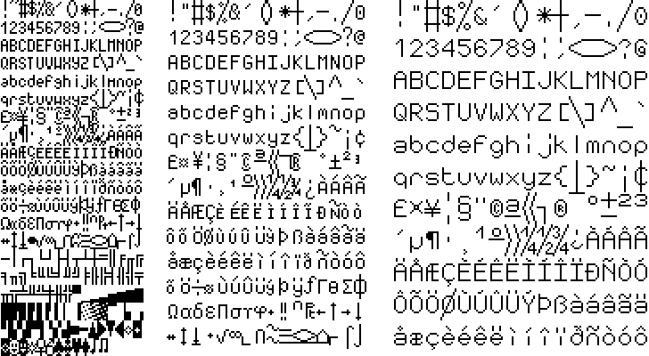
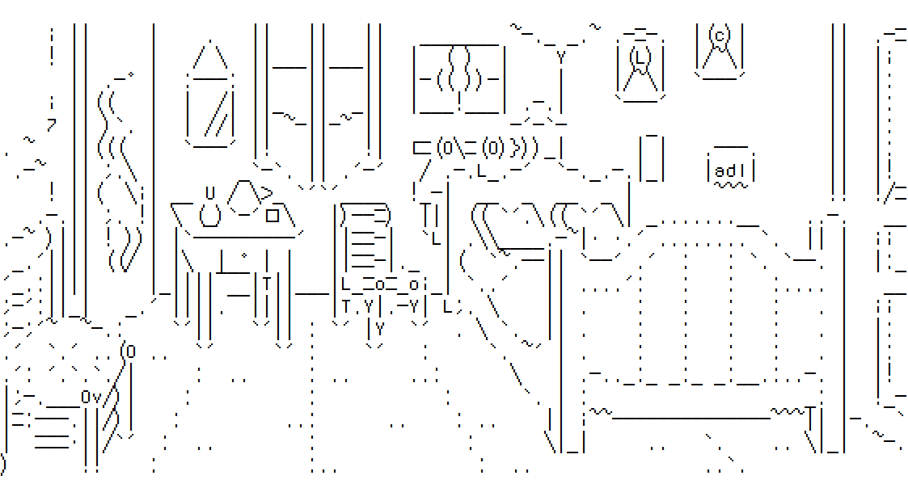
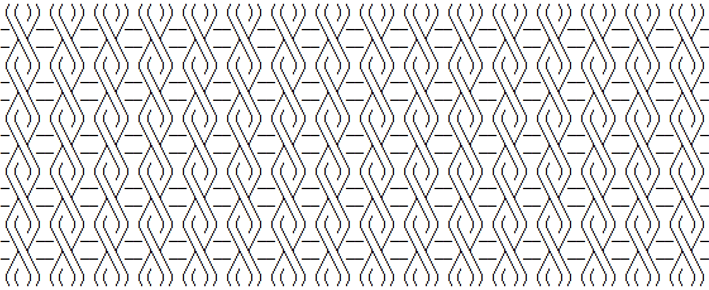
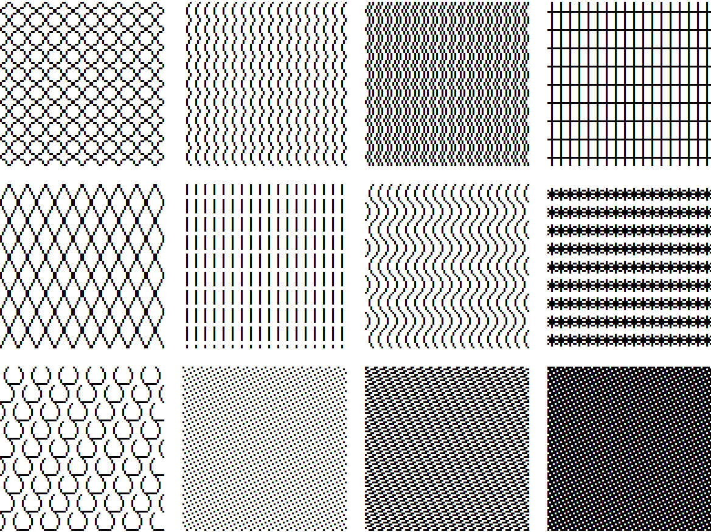

# Jgs Font

Jgs Font is a font family made in tribute to Joan G. Stark (aka jgs, Spunk), a
pioneer of ASCII art.

Jgs Font glyphs can be combined from one character to another, from one line to
another. Thus from single characters it is possible to draw continuous lines,
frames and patterns.

In order to change font size while keeping these effects of continuity at
pixel scale, the family is declined in three fonts.

- Jgs5 for sizes multiples of 10 : 10px, 20px, 30px etc.
- Jgs7 for sizes multiples of 14 : 14px, 28px, 42px etc.
- Jgs9 for sizes multiples of 18: 18px, 36px, 54px etc.

Notes
-----

Jgs Font is made with <a href="www.fontforge.org">FontForge</a>.

Jgs Font is still an unfinished project. Some characters are still missing
and the formal correspondences between the sizes remain to be worked.

You will find a table of characters and comparison between fonts on
www.adelfaure.net/tools/jgs/jgs_table.html

License
-------

Copyright (c) 2022, Adel Faure contact@adelfaure.net, with Reserved Font Name
Jgs Font, jgs5, jgs7, jgs9.

This Font Software is licensed under the SIL Open Font License, Version 1.1.
This license is copied below, and is also available with a FAQ at:
http://scripts.sil.org/OFL
