% About ASCII Art and the Jgs Font
% Adel Faure
% 2023
---
lang: en-US
---

Introduction
------------

I'm Adel Faure, ASCII artist operating within the Mistigris and Textmode
Friends collectives. I've been generously invited by Velvetyne to publish Jgs
Font on their foundry. Jgs Font is a typeface that I've created as a tribute to
artist Joan G. Stark and that I use to make ASCII art (see specimen).

In this article I contextualize what ASCII art is, who Joan G. Stark is, what
could be seen as a "history of text mode arts", what does ASCII Art means
today, and what are the characteristics of the Jgs font.

I'd like to sincerely thank Heikki Lotvonen for sharing two iconographic
references with me (_The Printer's Grammar_, John Smith, 1755 and
_Improvisation_, late 18th century) as well as for his text _ASCII art : From a
Commodity Into an Obscurity_, that helped me greatly.

I'd also like to thank Raphaël Bastide, Ève Gauthier and Vincent Maillard for
helping me review and finish this text.

Last but not least, many thanks to Ariel Martín Pérez for his proofreading and
and for the English translation of this text.

Good read!

What is ASCII Art?
------------------

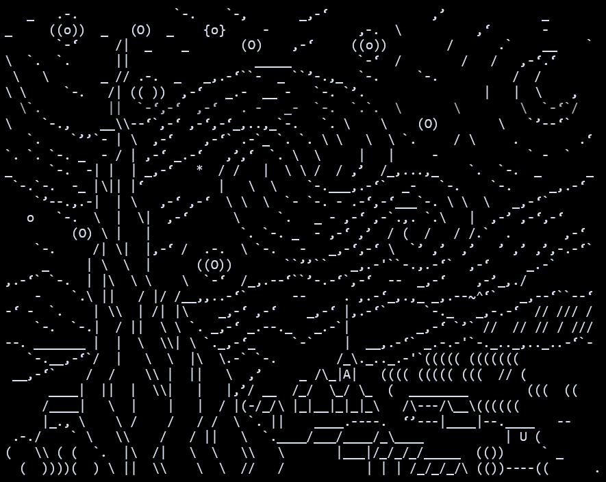

It isn't that simple to explain what ASCII Art means. More than defining a well
established practice, ASCII Art blurs the habitual distinction between image
and text, in the art world, and between "graphic interface" and "text mode," in
the informatics domain.

Strictly speaking, the expression designates pictures composed by using the 128
characters contained in the American Standard Code for Information Interchange
(shortened as ASCII). Even if the terms "Text Art" or "Textmode Art" are also
used, "ASCII Art" or just "ASCII" has become a way of naming all pictures
produced with the help of typographic elements. In 1999, in The History of
ASCII (text) Art, Joan G. Stark describes ASCII in the following way:

> They are “non-graphical graphics”. Its palette is limited to the symbols and
> characters that you have available to you on your computer keyboard.[^1]

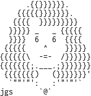

Joan G. Stark, A.K.A. jgs or Spunk, is probably the most popular and prolific
ASCII artist of the 1990s and the '00s, who left a strong imprint on online
amateur practices and aesthetics. Stark started making ASCII art in 1995 as
part of the <alt.ascii-art> newsgroup on USENET. Being passionate about
folklore and popular art, she devoted herself to represent in a "line style"
way (that could be seen as close to the "ligne claire" style in comics)
countless mythological creatures, animals, landscape elements, objects and
scenes of everyday life. She published the totality of her drawings as well as
texts about ASCII, its practice and its history, on her website
www.ascii-art.com. Even if the website is no longer online, it can be accessed
through many links [like this
one.](https://web.archive.org/web/20091028013825/http://www.geocities.com/SoHo/7373/).

Her definition of ASCII as “non-graphical graphics” plays with the ambiguity of
the English word "graphic", which either means a figurative object or an
element of a graphic interface. At the time of Stark's phrase, the first
digital social networks (Usenet, BBS, Minitel, Ceefax, etc.), still very
popular back then, worked in "text mode". They present user interfaces where
the screen is divided in a grid in which each case can display a single glyph.
As these interfaces disappeared in favor of graphic interfaces, Stark
underlines with irony the ambiguous status of ASCII art: the presence of
graphic elements in text environments becomes this oddity that is ASCII.

Even as she embraces its complexity, Stark summarizes the practice of ASCII to
something very simple: it's a way of drawing with what a computer keyboard
provides. "Its palette is limited to the symbols and characters that you have
available to you on your computer keyboard." Based on this statement, one can
only imagine that each system associated with a keyboard would produce a
different ASCII. That's the reason we can find terms like PETSCII associated
with the Commodore PET/CBM, ANSI with the BBS (Bulletin Board Systems), ATASCII
with Atari, Shift-JIS with the Katakana mode of Japanese keyboards, Teletext
with Videotext (Prestel, Minitel). In this galaxy, the expression "ASCII"
refers more specifically to the Amiga styles (oldschool and newschool), or the
Usenet styles (line-style and solid-style). Each one of these ASCII have their
own scene, with their groups, their artists and sometimes even their own
publishing platform.

- [www.asciiarena.se](https://www.asciiarena.se) - Amiga ASCII
- [www.16colo.rs](https://www.16colo.rs) - ANSI
- [www.csdb.dk](https://www.csdb.dk) - PETSCII
- [www.teletextart.co.uk](https://www.teletextart.co.uk) - Teletext

Some examples 
-------------

In the same way that each system can have their own specific ASCII art, each
style has their own origin, practice and history.

The PETSCII character set, designed mainly by Chuck Peddle, the designer of the
Commodore PET, and by Leonard Tramiel, son of the Commodore founder, includes
patterns and geometrical shapes, which facilitates the creation of games on a
text mode-only system.

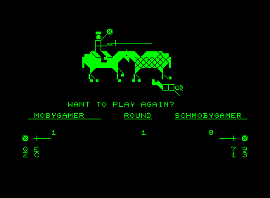

In _ASCII art : From a Commodity Into an Obscurity_, Heikki Lotvonen recalls the social role of ASCII art in the emerging ANSI scene. Users who were not hackers but who were skilled in ASCII art could obtain access to the contents of pirate BBS in exchange for their illustrations.[^2]

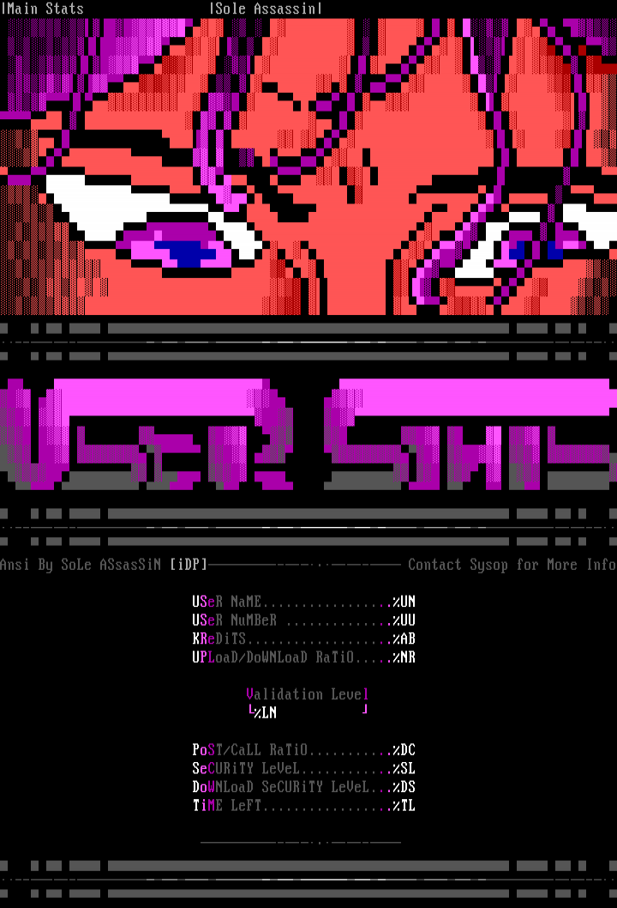

As it's very simple to reproduce and to modify it (by copy and paste), ASCII
was the preferred way to display memes on the first forum networks, notably
visible in the immense archive of [www.asciiartfarts.com
(archived)](https://web.archive.org/web/20230208045620/http://www.asciiartfarts.com/)
(which unfortunately contains numerous examples of homophobic, misogynistic
and/or racist content).

Certain popular internet characters come specifically from ASCII art. That's
the case, for instance, of "Kuma" (later known as Pedobear) and of "Domo", of
which the particular shape and positions have their origin on SHIFT-JIS shared
on 2chan.

) and its contemporary rendition ](img/kuma.gif)

 and a plush of the «Domo» characters](img/2ch_AA_Characters.gif)

A history of text-mode arts
---------------------------

In the late '00s, Unicode became the international standard for the digital
encoding of characters. As its name suggests, Unicode has the objective of
comprising the totality of character encoding modes, therefore rendering
obsolete the technical particularities of former techniques associated with
ASCII, ANSI, ATASCII, PETSCII, SHIFT-JIS, etc. Even if the emulation of older
OS and the strict application of their standards constitutes a significant part
of the practices within the contemporary ASCII scenes, it is clear for many
artists that ASCII art is a notion that needs to be extended beyond the
technical specificities of particular machines. Some of them prefer to use the
notion of "Textmode art", as the name of the group "Texmode Friends" suggests.

This attitude reinforces once again Stark's approach to ASCII art as a practice
that isn't solely based on the use of a particular encoding system but rather
on the possibility to create art with shapes that stem from the mechanization
of text.

This way, beyond the digital realm, everywhere and each time mechanized text
provides constraints, we can find a specific form of art in the shape of text
mode, ASCII art.

In Neither Good, Neither Good, Fast, Nor Cheap: Challenges of Early Arabic
Letterpress Printing, Hala Auji describes how printers of the first printing
presses of the Middle East bypassed the limits of lead composition in order to
produce ornaments.

> Les manuscrits, par exemple, comportaient des enluminures, à la manière de
> frontispices, appelés sarlawh ou ’unwan. Ces derniers, souvent très élaborés,
> étaient colorés et dorés à la main, afin d’indiquer le début de chaque livre et
> des chapitres suivants […]. Pour rappeler ces motifs dans leurs livres
> imprimés, les employés de cette presse ont utilisé divers types d’ornements,
> ainsi que des signes de ponctuation, reproduisant de manière créative des
> compositions similaires.

> Manuscripts, for example, used illumination devices, akin to frontispieces
> and headpieces, called a sarlawh or ’unwan. These were often elaborately
> hand-colored and gilded, to indicate the start of each book and its
> subsequent chapters […]. To recall these elaborate designs in their printed
> books, employees at this press creatively employed varied ornamental sorts,
> as well as punctuation marks, to create similar compositions.[^3]

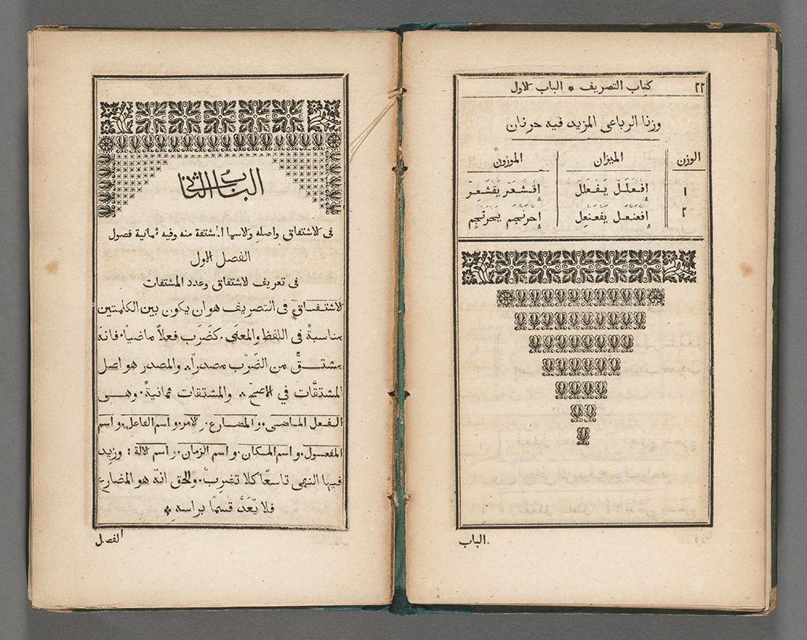

This way of subverting the art of typographic composition in order to produce
images isn't rare in the field of printing with movable lead type, which became
a necessity when there were missing pieces and turned into a hobby for
passionate employees.

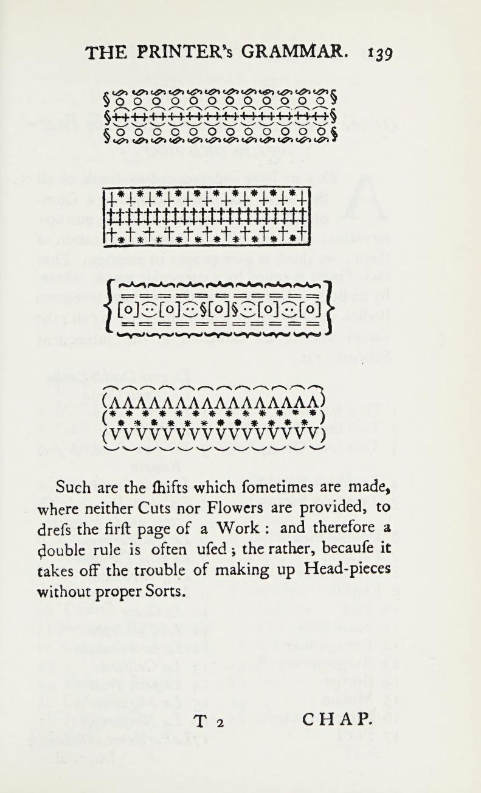

> Such are the shifts which sometimes are made, where neither Cuts nor Flowers
> are provided, to dress the first page of a Work : and therefore a double rule
> is often used ; the rather, because it takes off the trouble of making up
> Head-pieces without proper Sorts.

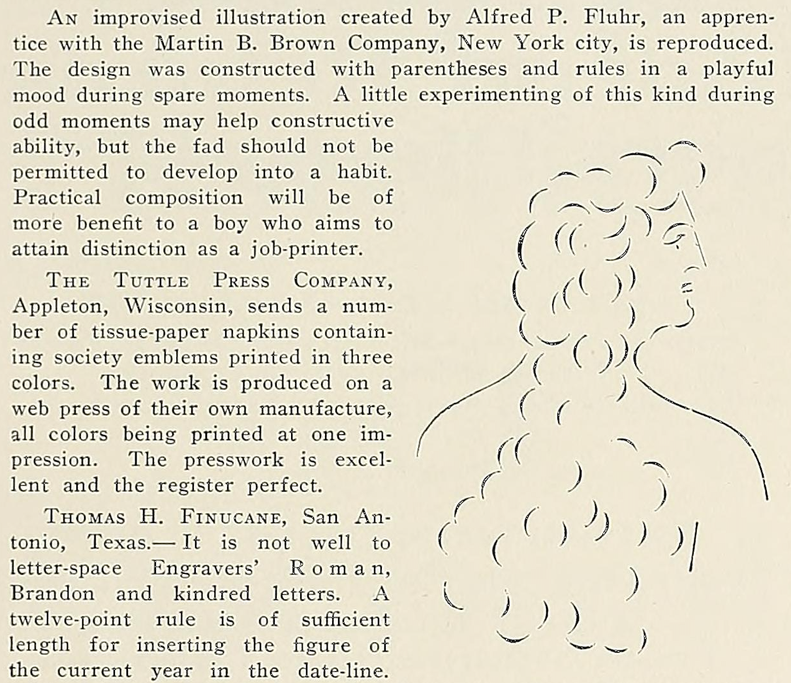

> An improvised illustration created by Alfred P. Fluhr, an apprentice with the
> Martin B. Brown Company, New York city, is reproduced. The design was
> constructed with parenthesis and rules in a playful mood during spare
> moments. A little experimenting of this kind during odd moments may help
> constructive ability, but the fad should not be permitted to develop into a
> habit. Practical composition will be of more benefit to a boy who aims to
> attain distinction as a job-printer.

Certain printers, such as Albert Schiller, who chose to specifically exploit
these kinds of methods to produce art works, were in some way the ASCII artists
of their time.

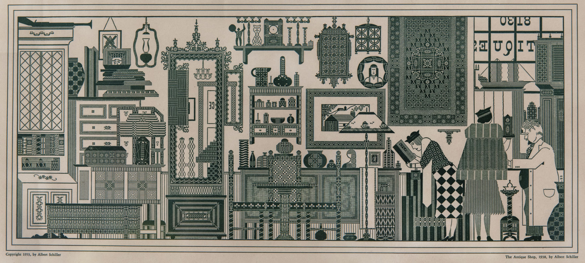

Is ASCII art a relic from the past?
-----------------------------------

In the same way that the popularization of graphic interfaces and the arrival
of Unicode could have sent ASCII art to oblivion, the personal computer could
have made typewriter drawing disappear. Yet the practice of the latter
continues to be revisited. Below this paragraph there's an extract from «Bob
Neill’s book of typewriter» where images composed with a typewriter are
accompanied with the protocol that would allow reproducing them, either by hand
or by using a typewriter. This book, published some mere years before the rapid
decline and the almost-complete disappearance of typewriter use, replaced by
computer keyboards and by text treatment programs, confirms in a way the
survival of the typewriter medium before it was actually rendered obsolete.

, Bob Neill, 1982](img/kojak_bob_neil.jpg)

The popularity of the artist James Cook is a good contemporary example of this
survival. Cook, however far from the digital practice, proposes to us
typewriter artworks made "en plein air", directly done in front of the model,
even outdoors, in the manner of a traditional painter.

](img/james_cook.jpg)

Through the long history of the mechanization of text, despite the sense of
obsolescence that stems from innovation processes, ASCII arts have allowed
numerous forgotten machines, deemed as useless, to reemerge. They have revealed
formal and cultural particularities that are impossible to replace. A manner,
in some way to prove that a technical mean can never be truly reduced to
impertinence or nostalgia.

> The lure of ASCII art might not be in the nostalgia of how it looks, but what
> it represents: the ideals of «cyberspace». It stands for a wistful longing
> for those pre-internet days when corporations hadn’t yet taken control of our
> digital day-to-day and the community was still in control of organising
> itself.[^2]

Jgs Font : a free monospaced font designed for ASCII art. A tribute to Joan G. Stark, ASCII art pioneer
-------------------------------------------------------------------------------------------------------

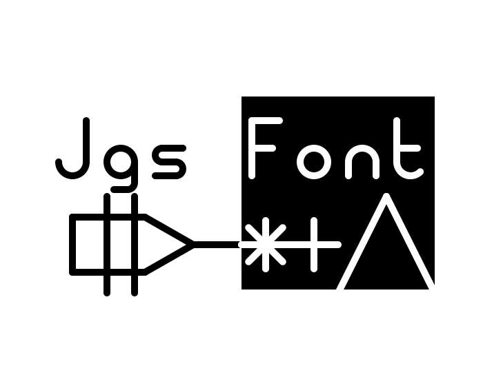

The visual aspect of text-based artworks is highly dependent on the font used.
That's why ASCII art is a highly typographic matter.

The most popular fonts used by ASCII artists are mainly those that come by default with legacy systems. 

This is the case of Monaco and Menlo, which have long been the default
monospaced fonts integrated into macOS, associated with ASCII line-style. An
emblematic example is MS PGothic, the eternal font of SHIFT-JIS practices, the
first Microsoft font to include "CJK characters", i.e. the inclusion of
encoding tables for the Chinese, Japanese and Korean languages.

While being very inspired by Stark's work, which draws in ASCII using Microsoft
fonts such as Courirer from FixedSys, I started ASCII art using a Truetype
adaptation of TopazPlus, a Commodore 64 font. This adaptation is part of the
[Multi Platform Fonts In Amiga
Aspect](https://web.archive.org/web/20220526153300/https://www.trueschool.se/html/fonts.html)
project by the TrueSchool ascii group published in 2009. It contains vector
versions of the most popular fonts used in the Amiga scene. Most of these fonts
are themselves created by artists from the Amiga scene, such as P0T-NOoDLE by
Leo "Nudel" Davidson or MicroKnight, whose author is unknown.

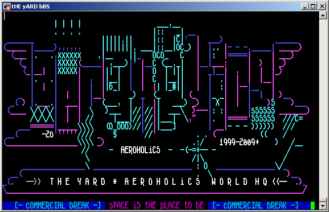

TopazPlus, like most Amiga fonts, has slash and anti-slash glyphs that join
character to character and line to line. This feature is at the heart of the
famous BASIC command "[10 PRINT CHR$(205.5+RND(1)); : GOTO
10](https://10print.org/)", producing an infinite labyrinth.

I was very impressed by this feature, finding in it the resolution of the
continuity effect I was looking for as an ASCII artist. So I started working on
a font in which all the glyphs would be as close as possible to this effect.

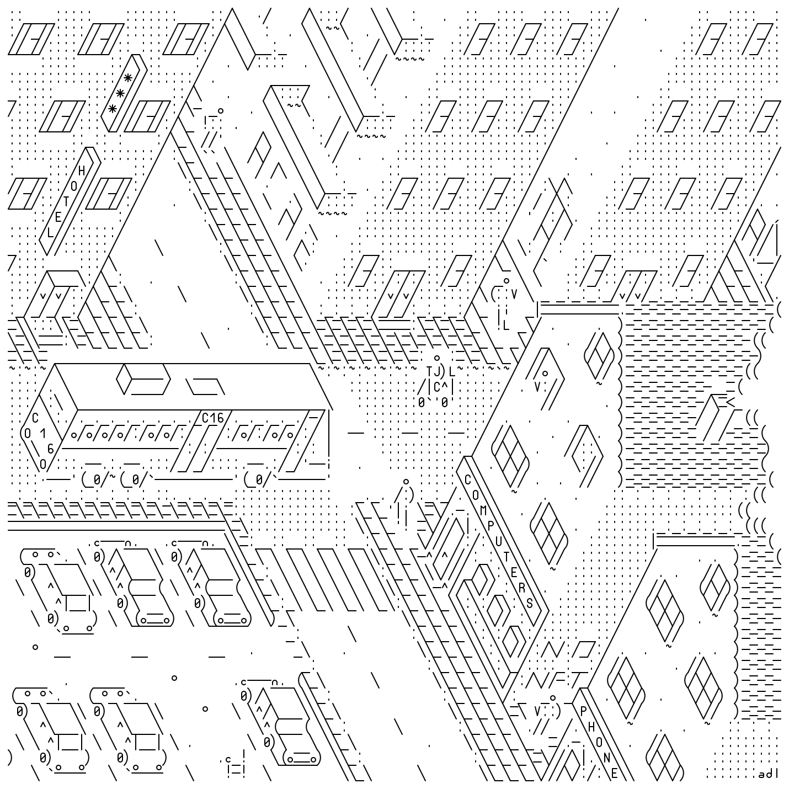

This is the principle behind the Jgs font. Its bitmap appearance and shapes
accentuate the ambiguity between text and drawing. The graphic properties of
the characters have been exaggerated according to the way ASCII artists use
them.

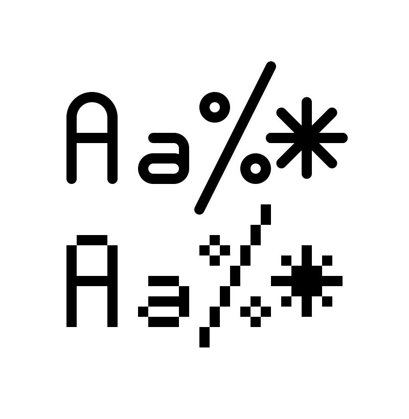

The glyphs that make up Jgs Font can be combined, sometimes in every direction.
It allows, by association of characters, to produce continuous lines, curves,
frames, patterns, levels of gray.

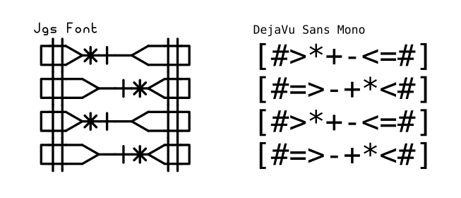

When glyphs don't combine directly, their shape is designed so that they can
match from afar.

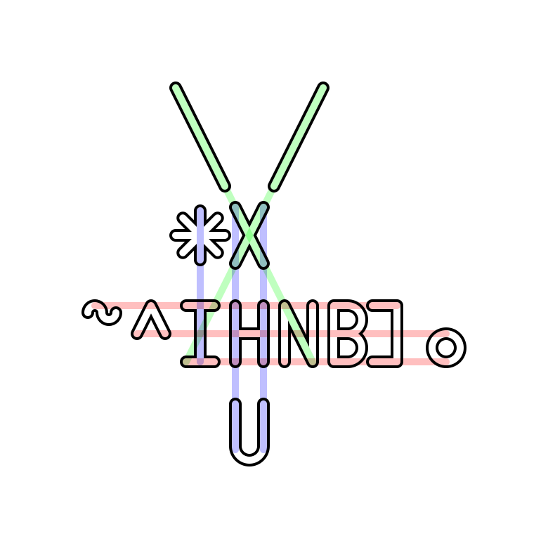

The Jgs font comes with the ASCII and Latin-1 Supplement encoding tables, as well as the glyphs found in code page 437, used for ANSI art.

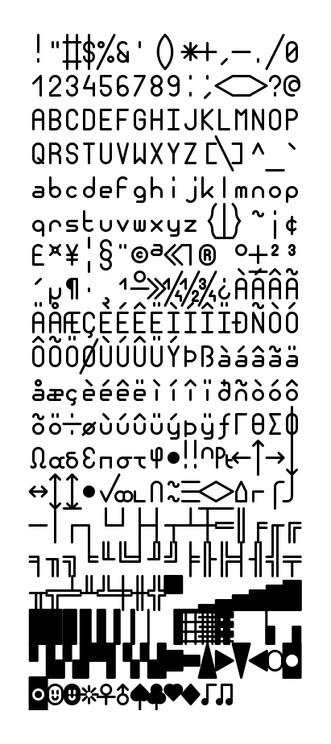

To conclude, you should know that this font is under free license. You are
therefore authorized to download it, share it and even modify it, as long as
you credit its origin. I hope you'll draw lots of cool things!
